# Lab1Web               <image src=https://c4.wallpaperflare.com/wallpaper/408/322/548/html5-hypertext-markup-language-logo-html-5-illustration-wallpaper-preview.jpg width="130px">

|**Nama**|**NIM**|**Kelas**|**Matkul**|
|----|---|-----|------|
|Muhammad Fiqri Setyoadi|312210062|TI.22.A.2|Pemograman Web|

## Dasar HTML
Sebelum kita mau mengoding HTML, kita harus membuka ``Tesk editor`` kita
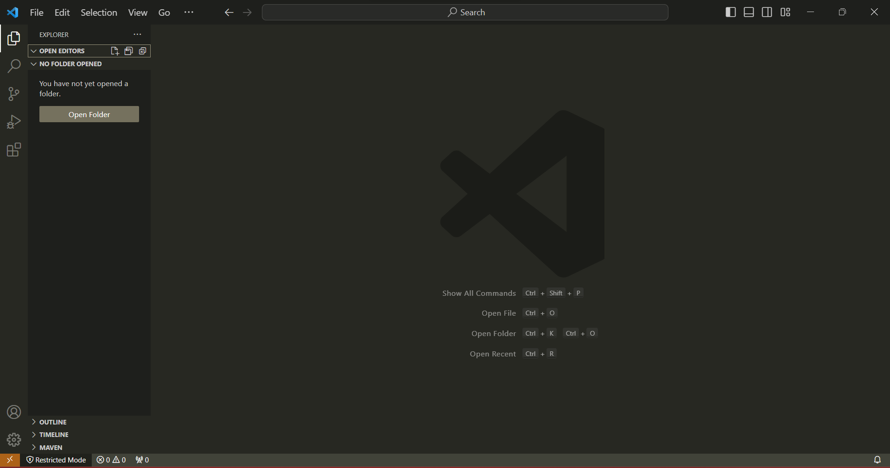
kemudian kita tulis pada bagian awal ketika sebelum ngoding dengan kode berikut:
```
html:5
```
1. Membuat Paragraf
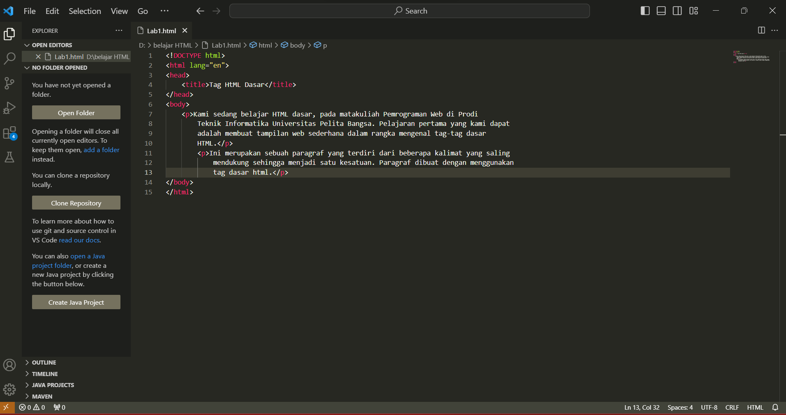
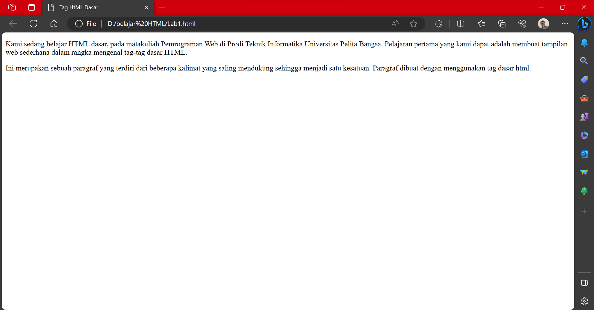

2. Menambahkan Judul
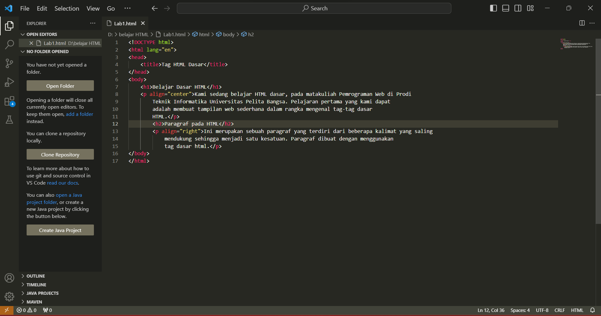
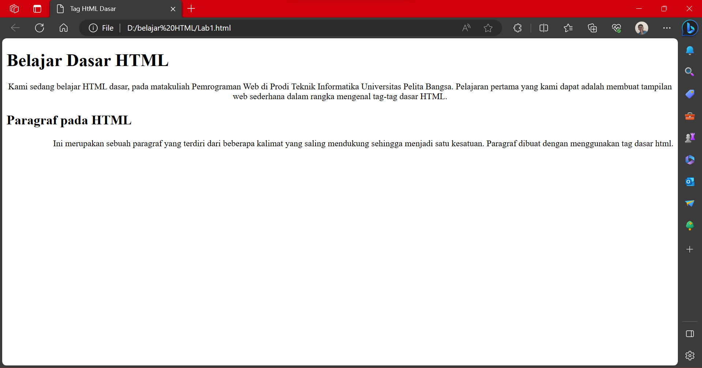

3. Memformat Teks
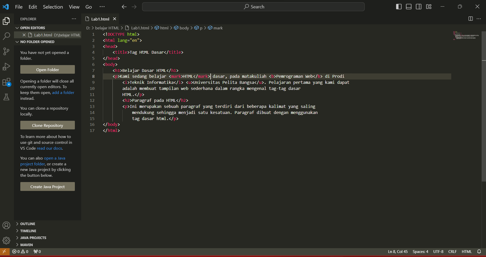
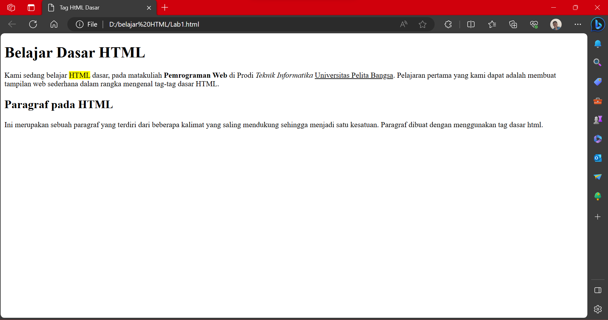

4. Menyisipkan Gambar
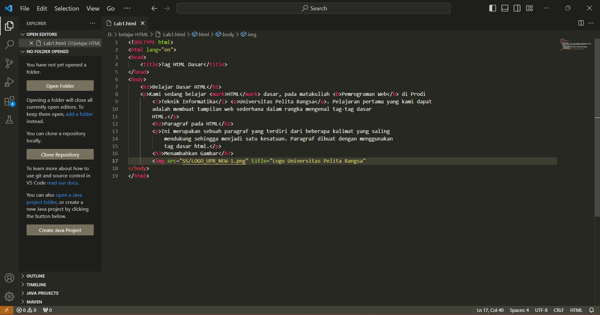
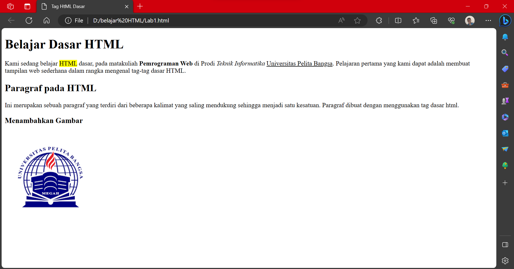

5. Menambahkan HyperLink
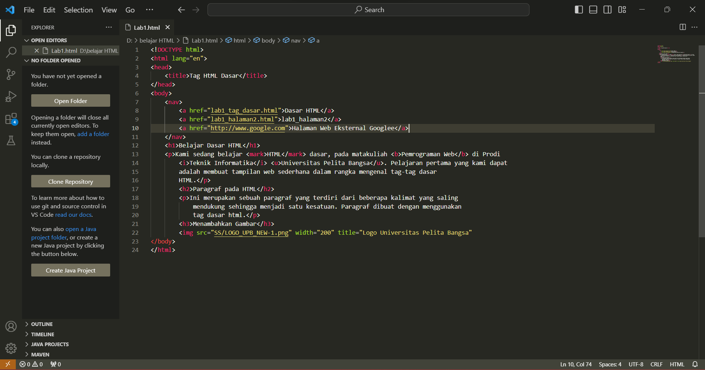
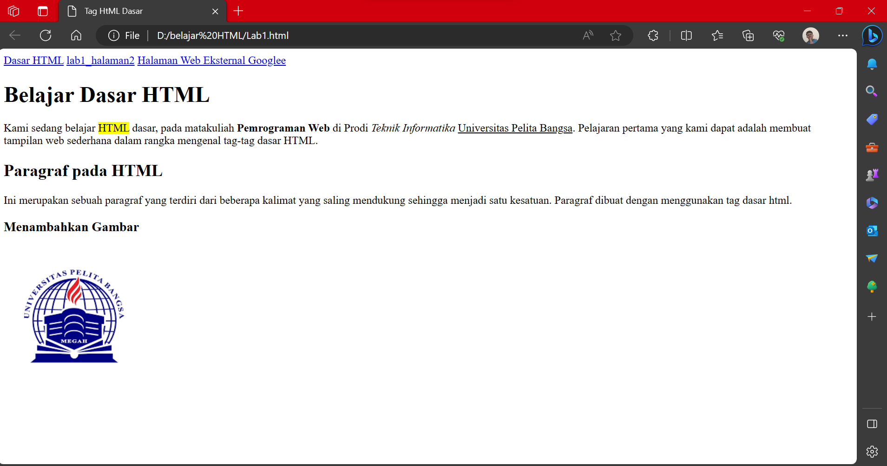

## Pertanyaan:

1. Lakukan perubahan pada kode sesuai dengan keinginan anda, amati perubahannya adakah
error ketika terjadi kesalahan penulisan tag?

2. Apa perbedaan dari tag ``<p>`` dengan tag ``<br>``, berikan penjelasannya!

3. Apa perbedaan atribut ``title`` dan ``alt`` pada tag ````, berikan penjelasannya!

4. Untuk mengatur ukuran gambar, digunakan atribut ``width`` dan ``height``. Agar tampilan gambar
proporsional sebaiknya kedua atribut tersebut diisi semua atau tidak? Berikan penjelasannya!

5. Pada link tambahkan atribut target dengan nilai atribut bervariasi ( _blank, _self, _top,
_parent ), apa yang terjadi pada masing-masing nilai antribut tersebut?

## Jawaban:

1. Tidak ada kesalahan asalkan alfabet nya masih sama seperti ``<p>/<P>`` itu sama saja.

2. tag ``<p>`` itu lebih ke sebuah paragraf baru, sedangkan ``<br>`` itu lebih seperti ke barisan/line baru.

3. _Atribut ``title``

    Deskripsi: Atribut ``alt`` digunakan untuk menyediakan teks alternatif yang akan muncul jika gambar tidak dapat ditampilkan atau saat pengguna menggunakan teknologi bantuan seperti pembaca layar.
    
    Fungsinya: Menjelaskan konten gambar: Ini membantu pengguna memahami konten gambar jika gambar tidak dapat ditampilkan atau jika mereka menggunakan perangkat dengan keterbatasan visual.

    _Atribut ``alt``

    Deskripsi: Atribut title digunakan untuk memberikan informasi tambahan saat pengguna mengarahkan kursor ke gambar. Ini akan muncul sebagai tooltip.

    Fungsinya:Memberikan informasi tambahan: Atribut title memberikan informasi tambahan atau konteks terkait gambar ketika pengguna mengarahkan kursor ke atas gambar.

4. Menurut saya lebih baik memilih salah satu dari keduanya antara ``width`` atau ``height``.

    ``Width`` untuk mengatur lebarnya, tapi tingginya masih sesuai dengan gambar aslinya.
    
    ``height`` untuk mengatur tingginya, tapi lebarnya masih sesuai gambar aslinya.

5. ``_blank``   : Membuka tab/ halaman baru.

    ``_self``   : Membuka halaman/ tab yang sama.

    ``_top``    : Membuka tautan/ halaman yang paling teratas(yang paling banyak dibuka).

    ``_Parent`` : Membuka halaman/tab yang mengandung tautan tersebut.


